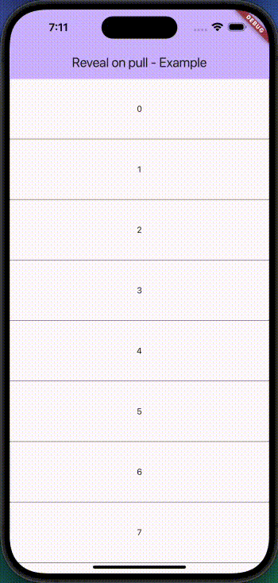

<p align="center">
  <a href="https://github.com/manaspratap/reveal_on_pull/stargazers">
    
  </a>
  <a href="https://github.com/manaspratap/reveal_on_pull/network/members">
    
  </a>
  <a href="https://github.com/manaspratap/reveal_on_pull/graphs/contributors">
    
  </a>
  <a href="https://github.com/manaspratap/reveal_on_pull/issues">
    
  </a>
  <a href="https://github.com/manaspratap/reveal_on_pull/blob/master/LICENSE.txt">
    
  </a>
  <br />
   <a href="https://www.buymeacoffee.com/manaspratap">
    
  </a>
   <a href="https://www.linkedin.com/in/manaspratapthakur">
    
  </a>
   <a href="https://manaspratap.com">
    
  </a>
</p>

<br />
<p align="center">
  <h1 align="center">RevealOnPull</h1>
</p>

📖 Table of Contents

- Features
- Installation
- Usage
- Example
- Contributing
- License

✨ Features

Easily reveal a hidden widget on pull down.
Customizable reveal behavior and animations.
Smooth and responsive user experience.
Compatible with both iOS and Android.

📦 Installation

Add the following to your pubspec.yaml file:

yaml
Copy code
dependencies:
reveal_on_pull: ^1.0.0
Then, run flutter pub get to install the package.

🚀 Usage

To use this package, wrap your widget tree with RevealOnPull and specify the widget to be revealed.

```dart
RevealOnPull(
  scrollController: scrollController,
  animationDuration: const Duration(milliseconds: 500),
  widgetToRevealHeight: widgetToRevealHeight,
  widgetToReveal: Container(
    height: widgetToRevealHeight,
    width: MediaQuery.of(context).size.width,
    color: Colors.red,
  ),
  scrollableChild: CustomScrollView(
    controller: scrollController,
    physics: const ClampingScrollPhysics(),
    slivers: [
      SliverList(
        delegate: SliverChildListDelegate(
          [
            for (var index = 0; index < 100; index++)
              Container(
                height: 100,
                decoration: BoxDecoration(
                  border: Border.all(width: 0.1),
                ),
                alignment: Alignment.center,
                child: Text('$index'),
              ),
          ],
        ),
      ),
    ],
  ),
)
```

🧪 Example

Check out the example directory for a complete sample app using RevealOnPull.

## 📺 Demo Video



🤝 Contributing

Contributions are welcome! If you encounter any issues or have suggestions for improvements, please open an issue or submit a pull request on GitHub.

Steps to Contribute
Fork the repository.
Create a new branch: git checkout -b my-feature-branch.
Make your changes and commit: git commit -m 'Add some feature'.
Push to the branch: git push origin my-feature-branch.
Open a pull request.

📄 License

This project is licensed under the BSD 3-Clause License. See the LICENSE file for more details.
